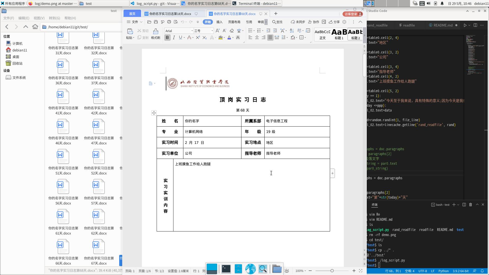

# 经贸实习日志生成脚本
## demo


### 运行环境debian10 or CentOS7    python3.6及以下

### debian install
    sudo apt install git python3 pip
    
### CentOS install
    sudo yum install python3 git pip


```
pip3 install python-docx
git clone https://github.com/mexiuxin/log.git
cd log
vim log_script
修改信息，跟着模板走

./log_script
```
脚本默认从3月1开始写，写够120天(但是实际上日期只会保留到531日)
